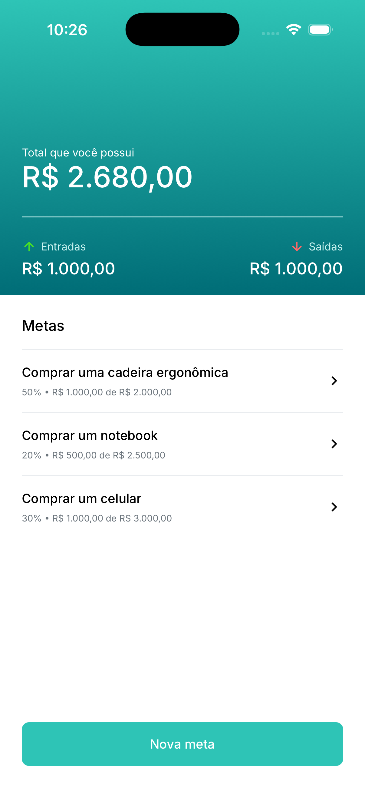
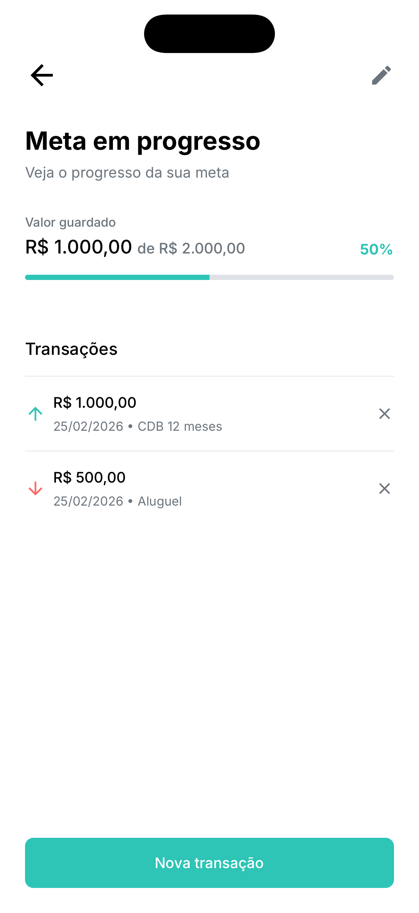
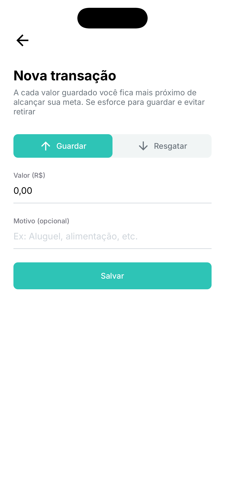
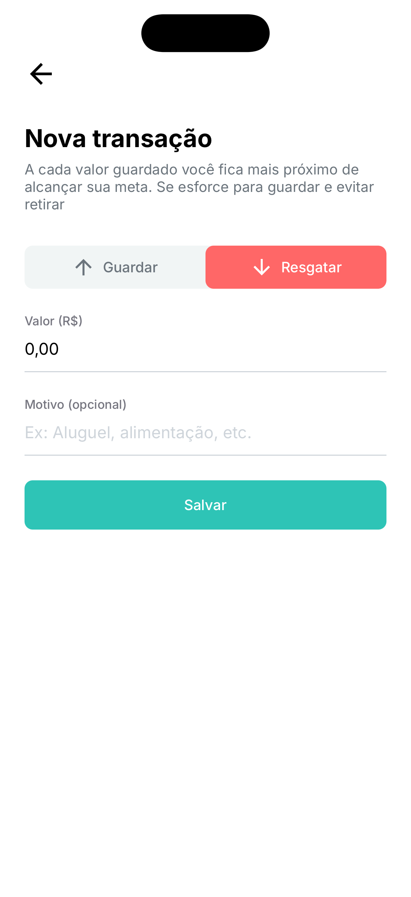

# 🎯 Target App

> Aplicativo para controle de metas financeiras — crie metas, acompanhe o progresso e gerencie entradas e saídas com simplicidade.

---

## 📖 Sobre o projeto

O **Target App** é um aplicativo mobile focado em **controle de metas**. Com ele você define metas financeiras (como uma viagem, um eletrônico ou qualquer objetivo), acompanha quanto já guardou e quanto falta, e registra cada valor que entra ou sai da meta. Tudo fica salvo localmente no dispositivo, com interface limpa e fácil de usar.

---

## ✨ Funcionalidades

| Funcionalidade      | Descrição                                                           |
| ------------------- | ------------------------------------------------------------------- |
| **Criar meta**      | Defina o nome da meta e o valor alvo em reais (R$).                 |
| **Acompanhar meta** | Veja o progresso em porcentagem e o valor atual vs. valor alvo.     |
| **Guardar valor**   | Registre valores que entram na meta (depósitos).                    |
| **Retirar valor**   | Registre valores que saem da meta (retiradas), com motivo opcional. |
| **Listar metas**    | Visualize todas as suas metas na tela inicial.                      |
| **Apagar meta**     | Remova metas que não deseja mais acompanhar.                        |
| **Transações**      | Histórico de entradas e saídas por meta, com data e descrição.      |

---

## 🛠 Tecnologias utilizadas

- **[React Native](https://reactnative.dev/)** — desenvolvimento mobile multiplataforma
- **[Expo](https://expo.dev/)** — ferramentas e fluxo de build (Expo Router, SQLite, fontes)
- **[Expo Router](https://docs.expo.dev/router/introduction/)** — roteamento baseado em arquivos
- **[Expo SQLite](https://docs.expo.dev/versions/latest/sdk/sqlite/)** — banco de dados local para metas e transações
- **[TypeScript](https://www.typescriptlang.org/)** — tipagem estática
- **[React Native Currency Input](https://github.com/rafaelrocha/react-native-currency-input)** — input formatado para valores em R$
- **Google Fonts (Inter)** — tipografia (Regular, Medium, Bold)

---

## 🚀 Como rodar o projeto

### Pré-requisitos

- Node.js (recomendado: LTS)
- npm ou yarn
- [Expo CLI](https://docs.expo.dev/get-started/installation/) (opcional; `npx expo` também funciona)
- Para iOS: Xcode e simulador ou dispositivo
- Para Android: Android Studio e emulador ou dispositivo

### Instalação

```bash
# Clone o repositório
git clone <url-do-repositorio>
cd target-app

# Instale as dependências
npm install

# Inicie o projeto
npm start
```

### Executar no dispositivo/emulador

```bash
# iOS
npm run ios

# Android
npm run android

# Web (preview)
npm run web
```

---

## 📱 Demonstração

### Telas do aplicativo

#### Tela inicial (listagem de metas)



#### Criação de uma meta e acompanhamento

<table>
  <tr>
    <td></td>
    <td></td>
  </tr>
</table>

#### Nova transação (guardar ou retirar valor)

<table>
  <tr>
    <td></td>
    <td></td>
  </tr>
</table>

---

## 📁 Estrutura do projeto (resumo)

```
src/
├── app/                 # Rotas (Expo Router)
│   ├── _layout.tsx      # Layout global, SQLite, fontes
│   ├── index.tsx        # Tela inicial (metas)
│   ├── target.tsx       # Criar/editar meta
│   ├── in-progress/[id].tsx   # Detalhes da meta + transações
│   └── transaction/[id].tsx   # Nova transação (entrada/saída)
├── components/          # Componentes reutilizáveis
├── database/           # Migrations e lógica do SQLite
├── theme/              # Cores e tipografia
└── utils/              # Utilitários (ex.: tipos de transação)
```

---

## 📄 Licença

Este projeto é de uso pessoal. Sinta-se à vontade para usar e adaptar.

---

<p align="center">
  TargetApp, para ajudar a alcançar suas metas!
</p>
